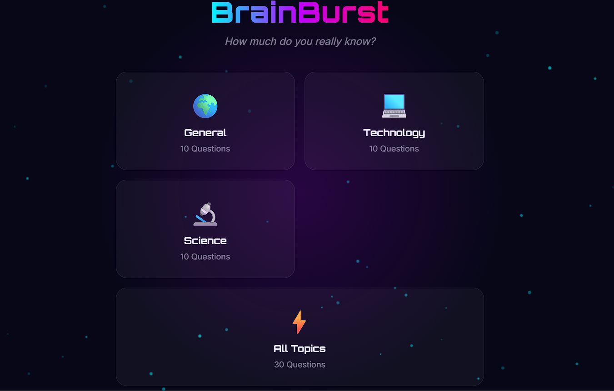
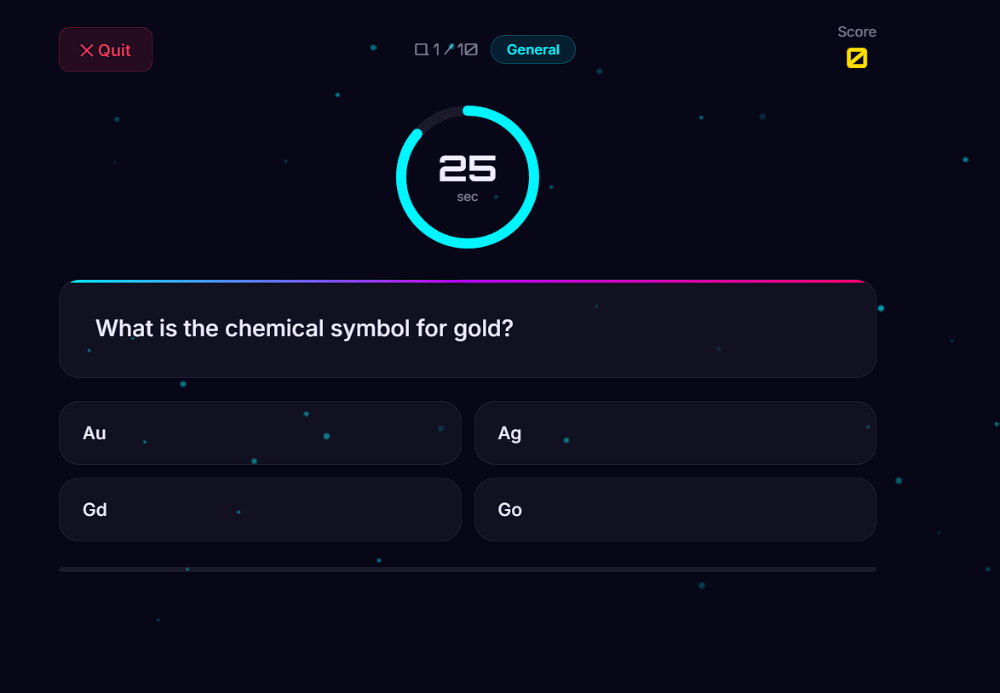
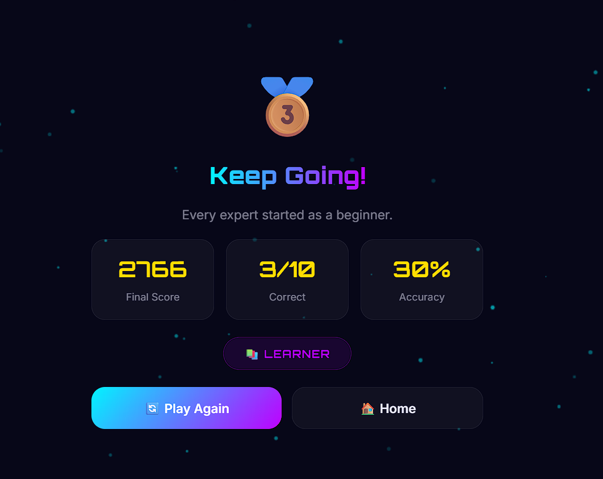

<h1 align="center">🧠 BrainBurst Quiz</h1>

<p align="center">
  <strong>A fast-paced, neon-themed knowledge quiz with time-based scoring, confetti, and high scores.</strong><br/>
  Test yourself across General Knowledge, Technology, and Science — the clock is always ticking!
</p>

<p align="center">
  
  
  
  
  
</p>

---

## 📸 Screenshots

### 🏠 Homepage — Category Selection Screen
> The neon-lit home screen greets players with the BrainBurst logo in a glowing cyan-to-pink gradient, set against a particle-animated dark background. Four category cards let you choose your challenge: **General** (10 Qs), **Technology** (10 Qs), **Science** (10 Qs), or **All Topics** (30 Qs shuffled). High scores saved to localStorage are displayed below.



---

### ⏱️ Quiz Screen — Question in Progress
> During the quiz, a glowing cyan SVG countdown ring ticks from 30 seconds — answer faster for bigger time bonuses. The current question is displayed in a glassmorphism card with a neon gradient top border. Four answer buttons are shown in a 2×2 grid. The score updates live in the top-right corner and a progress bar fills along the bottom.



---

### 🏆 Results Screen — Quiz Complete
> After all questions are answered, the result screen displays the final score, number of correct answers, accuracy percentage, and a performance badge. A trophy emoji and motivational message match the accuracy tier achieved. **Play Again** and **Home** buttons let you retry or switch categories.



---

## ✨ Features

| Feature | Description |
|---|---|
| 🌍 3 Categories | General Knowledge, Technology, Science |
| ⚡ All Topics Mode | 30 shuffled questions from all categories |
| ⏱️ 30-Second Timer | Animated SVG ring; turns yellow at 15s, red at 8s |
| 🎯 Time-Bonus Scoring | Faster answers = higher score (up to 1,000 pts/question) |
| 🔀 Shuffled Every Round | Questions and answer positions randomized each game |
| ✅❌ Instant Feedback | Green flash for correct, red shake animation for wrong |
| 🏆 Results Screen | Final score, accuracy %, performance badge, trophy |
| 🎉 Confetti Explosion | Fires when accuracy reaches 70% or above |
| 💾 High Scores | Best score per category saved to localStorage |
| ✨ Particle Background | Floating animated dots on the home screen |
| 📱 Fully Responsive | Optimized for both mobile and desktop |

---

## 🏅 Performance Badges

| Accuracy | Trophy | Badge |
|---|---|---|
| ≥ 90% | 🏆 | ⭐ QUIZ MASTER |
| ≥ 70% | 🥇 | 🔥 BRAINIAC |
| ≥ 50% | 🥈 | 💡 CHALLENGER |
| < 50%  | 🥉 | 📚 LEARNER |

---

## 🛠️ Tech Stack

| Technology | Purpose |
|---|---|
| HTML5 | Three-screen layout system (Home → Quiz → Results) |
| CSS3 | Cyberpunk neon theme, SVG timer ring, answer animations |
| JavaScript ES6+ | Quiz engine, shuffle logic, timer, scoring, localStorage |
| Canvas API | Particle background animation + confetti explosion |

---

## 📝 Question Bank

| Category | Count | Topics |
|---|---|---|
| 🌍 General Knowledge | 10 | Geography, history, nature, science basics |
| 💻 Technology | 10 | Programming, hardware, famous companies, Git |
| 🔬 Science | 10 | Physics, chemistry, biology, space |
| ⚡ All Topics | 30 | Everything above, shuffled together |

---

## 📁 Project Structure

```
brainburst-quiz/
├── index.html        # Three screens: Home, Quiz, Results
├── style.css         # Cyberpunk neon dark theme
├── script.js         # Quiz engine: 30 questions, timer, scoring, confetti
└── Screenshots/
    ├── HOMEPAGE.png
    ├── DURING_QUIZ_QUESTION_ON_SCREEN.png
    └── QUIZ_RESULT_SCREEN_AFTER_COMPLEATION.png
```

---

## 🚀 Getting Started

```bash
git clone https://github.com/qasim-safi/brainburst-quiz.git
cd brainburst-quiz
open index.html
```

No Node.js, no npm, no API key. Open the file and start playing instantly.

---

## 👨‍💻 Developer

**Qasim Safi** — BS Software Engineering Student  
🌐 Django Web Dev | 📱 Flutter App Dev | 🐍 Python & Java

[](https://github.com/qasim-safi)

---

## 📄 License

MIT License — free to use, play, and extend!
